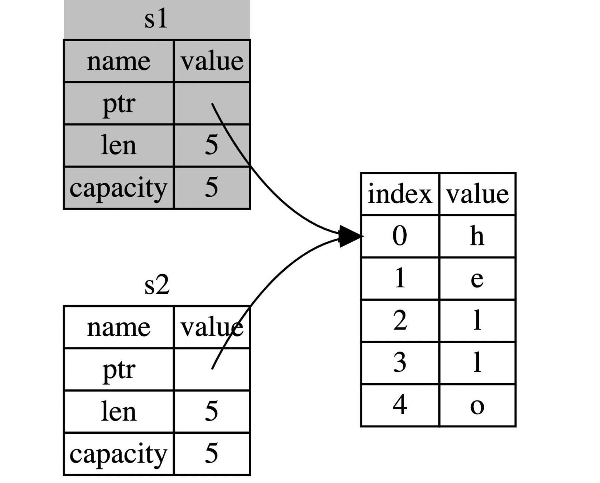

# 所有权和借用

Rust 语言的很大亮点之一是没有 gc 也无需手动内存管理，而实现这一功能的是 “**所有权系统**”

## 所有权

所有的程序都必须和计算机内存打交道，如何从内存中申请空间来存放程序的运行内容，如何在不需要的时候释放这些空间，成了重中之重，也是所有编程语言设计的难点之一。在计算机语言不断演变过程中，出现了三种流派：

- **垃圾回收机制(GC)**，在程序运行时不断寻找不再使用的内存，典型代表：Java、Go
- **手动管理内存的分配和释放**, 在程序中，通过函数调用的方式来申请和释放内存，典型代表：C++
- **通过所有权来管理内存**，编译器在编译时会根据一系列规则进行检查

其中 Rust 选择了第三种，最妙的是，这种检查只发生在编译期，因此对于程序运行期，不会有任何性能上的损失。

### 一段不安全的代码

```c
int* foo() {
    int a;          // 变量a的作用域开始
    a = 100;
    char *c = "xyz";   // 变量c的作用域开始
    return &a;
}                   // 变量a和c的作用域结束
```

变量 a 是局部变量，函数结束后其内存会被回收，其地址被返回，会造成 `悬空指针(Dangling Pointer)` 的问题。

变量 c 是常量字符串，可能这个函数我们只调用了一次，也可能我们不再会使用这个字符串，但 `"xyz"` 只有当整个程序结束后系统才能回收这片内存。

这些内存安全问题一直很令人头疼，在 Java 或 Go 语言中有垃圾回收 (GC) 来处理，但是这会影响性能，而在 Rust 中，在编译的时候编译器就会检查内存不安全的问题。

### 栈(Stack)与堆(Heap)

固定大小的值存储在栈上，性能很高。

不固定大小的值存储在堆上，性能较差。

堆上的数据需要组织，需要恰当地分配和释放。否则会造成内存泄漏。

### 所有权原则

1. Rust 中每一个值都被一个变量所拥有，该变量被称为值的所有者
2. 一个值同时只能被一个变量所拥有，或者说一个值只能拥有一个所有者
3. 当所有者 (变量) 离开作用域范围时，这个值将被丢弃 (drop)

#### 变量作用域

就作用域来说，Rust 语言跟其他编程语言没有区别。

#### 简单介绍 String 类型

字符串字面值 `let s ="hello"`，`s` 是被硬编码进程序里的字符串值（类型为 `&str` ）。

字符串字面值是很方便的，但是它并不适用于所有场景。原因有二：

1. 字符串字面值是不可变的，因为被硬编码到程序代码中
2. 并非所有字符串的值都能在编写代码时得知

例如，字符串是需要程序运行时，通过用户动态输入然后存储在内存中的，这种情况，字符串字面值就完全无用武之地。

为此，Rust 为我们提供动态字符串类型: `String`, 该类型被分配到堆上，因此可以动态伸缩，也就能存储在编译时大小未知的文本。

```rust
let s = String::from("hello");
```

`::` 是一种调用操作符，这里表示调用 `String` 中的 `from` 方法。

因为 `String` 存储在堆上，是动态的，可以这样修改 String：

```rust
let mut s = String::from("hello");

s.push_str(", world!"); // push_str() 在字符串后追加字面值

println!("{}", s); // 将打印 `hello, world!`
```

### 变量绑定背后的数据交互

#### 转移所有权

```rust
let x = 5;
let y = x;
```

将 5 的值绑定到变量 x，接着拷贝 x 的值给 y。最终 x 和 y 都等于 5。

因为整数是 Rust 基本数据类型，是固定大小的简单值，因此这两个值都是通过自动拷贝的方式来赋值的，都被存在栈中，完全无需在堆上分配内存。

```rust
let s1 = String::from("hello");
let s2 = s1;
```

这里 `String` 不是基本数据类型，它是存储在堆上的，无法直接拷贝。

`String` 类型是一个复杂类型，由**存储在栈中的堆指针**、**字符串长度**、**字符串容量**共同组成

总之 `String` 类型指向了一个堆上的空间，这里存储着它的真实数据, 下面对上面代码中的 `let s2 = s1` 分成两种情况讨论：

1. 拷贝 `String` 和存储在堆上的字节数组 如果该语句是拷贝所有数据(深拷贝)，那么无论是 `String` 本身还是底层的堆上数据，都会被全部拷贝，这对于性能而言会造成非常大的影响
2. 只拷贝 `String` 本身 这样的拷贝非常快，因为在 64 位机器上就拷贝了 8字节的指针、8字节的长度、8字节的容量，总计 24 字节，但是带来了新的问题，还记得我们之前提到的所有权规则吧？其中有一条就是：一个值只允许有一个所有者，而现在这个值（堆上的真实字符串数据）有了两个所有者：`s1` 和 `s2`。

当变量离开作用域后，Rust 会自动调用 `drop` 函数并清理变量的堆内存。不过由于两个 `String` 变量指向了同一位置。这就有了一个问题：当 `s1` 和 `s2` 离开作用域，它们都会尝试释放相同的内存。这是一个叫做 **二次释放**（double free） 的错误，也是之前提到过的内存安全性 BUG 之一。两次释放（相同）内存会导致内存污染，它可能会导致潜在的安全漏洞。

因此，Rust 这样解决问题：**当 `s1` 赋予 `s2` 后，Rust 认为 `s1` 不再有效，因此也无需在 `s1` 离开作用域后 `drop` 任何东西，这就是把所有权从 `s1` 转移给了 `s2`，`s1` 在被赋予 `s2` 后就马上失效了。**

```rust
let s1 = String::from("hello");
let s2 = s1;

println!("{}, world!", s1); // error[E0382]: use of moved value: `s1`
```

如果你在其他语言中听说过术语 **浅拷贝(shallow copy)** 和 **深拷贝(deep copy)**，那么拷贝指针、长度和容量而不拷贝数据听起来就像浅拷贝，但是又因为 Rust 同时使第一个变量 `s1` 无效了，因此这个操作被称为 **移动(move)**，而不是浅拷贝。上面的例子可以解读为 `s1` 被**移动**到了 `s2` 中。那么具体发生了什么，用一张图简单说明：




